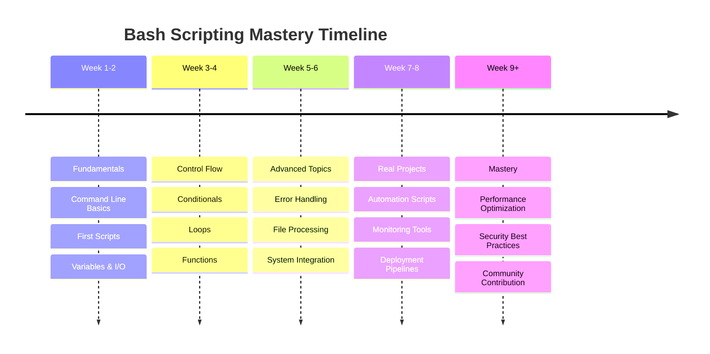

# 🐚 Learning Bash Scripting - Complete Mastery Guide

<div align="center">


[](https://github.com/eaamankwah/Certificates/blob/main/certificateofcompletion_Learning_bash_scripting_2022.pdf)

*Master the art of Bash scripting through hands-on practice and real-world examples*

[🚀 Quick Start](#-quick-start) •
[📚 Course Content](#-course-content) •
[💻 Practice Labs](#-practice-labs) •
[🛠️ Tools & Setup](#️-development-environment)


</div>

---

## 📖 About This Repository

This repository contains comprehensive materials for mastering **Bash scripting** - the essential skill for Linux system administration, DevOps, and automation. Based on the LinkedIn Learning course by **Scott Simpson**, this hands-on guide provides practical exercises, real-world examples, and progressive learning modules.

### 🎯 Learning Objectives

<table>
<tr>
<td width="50%">

**🔧 Core Skills**
* Master Bash command line interface
* Write efficient shell scripts
* Understand Linux file system operations
* Implement automation solutions

</td>
<td width="50%">

**🚀 Advanced Concepts**
* Control structures and flow control
* User interaction and input handling
* Error handling and debugging
* Performance optimization techniques

</td>
</tr>
</table>

---

## 🌟 Key Features

### 💡 **Practical Learning Approach**
* **Hands-on exercises** with real-world scenarios
* **Progressive difficulty** from basics to advanced
* **Interactive examples** you can run immediately
* **Best practices** from industry professionals

### ☁️ **Cloud-Ready Development**
* **GitHub Codespaces** integration for instant setup
* **No local installation** required
* **Consistent environment** across all devices
* **Professional IDE** features in the browser

### 📊 **Comprehensive Coverage**
* **Bash fundamentals** and syntax
* **Script creation** and execution
* **Advanced scripting** techniques
* **Debugging and troubleshooting**

---

## 🗂️ Repository Structure

```
📦 learning-bash-scripting/
├── 🔧 .devcontainer/           # GitHub Codespaces configuration
├── 🚀 .github/                 # GitHub workflows & templates
├── 💻 .vscode/                 # VS Code settings & extensions
├── 📁 Solutions/               # Exercise solutions & examples
├── 📂 dir1/                    # Practice directories
├── 📂 dir2/                    # File system exercises
├── 📂 dir3/                    # Advanced examples
├── 📝 Snippets.md              # Code snippets reference
├── 📄 list.txt                 # Sample data files
├── 📄 lorem.txt                # Text processing examples
├── 📄 output.txt               # Script output examples
├── ❌ error.txt                # Error handling examples
└── 📖 README.md                # This documentation
```

---

## 📚 Course Content & Learning Path

### 🎓 **Module 1: Bash Fundamentals**

<details>
<summary><b>📘 History & Significance of Bash</b></summary>

* Origins of Bash and Unix philosophy
* Why Bash is the default Linux shell
* Bash vs other shells (zsh, fish, csh)
* Industry adoption and career relevance

**🎯 Learning Outcomes:**
* Understand Bash's role in modern computing
* Recognize when to use Bash scripting
* Appreciate Unix philosophy principles

</details>

<details>
<summary><b>⚡ Command Line Basics</b></summary>

```bash
# Essential commands covered
ls -la                    # List files with details
cd /path/to/directory    # Navigate directories
pwd                      # Print working directory
chmod +x script.sh       # Make scripts executable
./script.sh             # Execute scripts
```

**🎯 Skills Developed:**
* Navigation and file operations
* Understanding permissions
* Command syntax and options
* Piping and redirection

</details>

### 🎓 **Module 2: Script Creation & Execution**

<details>
<summary><b>📝 Writing Your First Script</b></summary>

```bash
#!/bin/bash
# My first Bash script

echo "Hello, World!"
echo "Current date: $(date)"
echo "Current user: $USER"
echo "Current directory: $(pwd)"
```

**🔧 Key Concepts:**
* Shebang (`#!/bin/bash`) usage
* Script structure and organization
* Making scripts executable with `chmod +x`
* Running scripts with `./script.sh`

</details>

<details>
<summary><b>🔄 Variables & Data Types</b></summary>

```bash
#!/bin/bash

# Variable declaration
name="John Doe"
age=30
is_student=true

# Arrays
fruits=("apple" "banana" "orange")

# Environment variables
echo "Home directory: $HOME"
echo "Path: $PATH"

# Command substitution
current_date=$(date +%Y-%m-%d)
file_count=$(ls -1 | wc -l)
```

**🎯 Mastery Areas:**
* Variable naming conventions
* String and numeric operations
* Array manipulation
* Environment variable usage

</details>

### 🎓 **Module 3: Control Structures**

<details>
<summary><b>🔀 Conditional Statements</b></summary>

```bash
#!/bin/bash

# If-else statements
if [ "$1" = "start" ]; then
    echo "Starting the service..."
elif [ "$1" = "stop" ]; then
    echo "Stopping the service..."
else
    echo "Usage: $0 {start|stop}"
    exit 1
fi

# File existence check
if [ -f "config.txt" ]; then
    echo "Configuration file found"
    source config.txt
else
    echo "Creating default configuration..."
    echo "DEBUG=false" > config.txt
fi
```

**🧠 Advanced Patterns:**
* Multiple condition testing
* File and directory checks
* String comparisons
* Numeric comparisons

</details>

<details>
<summary><b>🔄 Loops & Iteration</b></summary>

```bash
#!/bin/bash

# For loop with array
servers=("web1" "web2" "db1")
for server in "${servers[@]}"; do
    echo "Connecting to $server..."
    # ssh commands would go here
done

# While loop for monitoring
counter=0
while [ $counter -lt 10 ]; do
    echo "Monitoring cycle: $counter"
    sleep 1
    ((counter++))
done

# Reading file line by line
while IFS= read -r line; do
    echo "Processing: $line"
done < input.txt
```

**🎯 Loop Mastery:**
* For loops with ranges and arrays
* While loops for conditions
* Processing files line by line
* Break and continue statements

</details>

### 🎓 **Module 4: User Interaction**

<details>
<summary><b>💬 Input & Output Handling</b></summary>

```bash
#!/bin/bash

# User input
read -p "Enter your name: " username
read -s -p "Enter password: " password
echo

# Input validation
while true; do
    read -p "Continue? (y/n): " answer
    case $answer in
        [Yy]* ) break;;
        [Nn]* ) echo "Goodbye!"; exit;;
        * ) echo "Please answer yes or no.";;
    esac
done

# Menu system
PS3="Select an option: "
options=("Deploy" "Test" "Rollback" "Quit")
select opt in "${options[@]}"; do
    case $opt in
        "Deploy") echo "Deploying..."; break;;
        "Test") echo "Testing..."; break;;
        "Rollback") echo "Rolling back..."; break;;
        "Quit") break;;
        *) echo "Invalid option";;
    esac
done
```

</details>

### 🎓 **Module 5: Advanced Scripting**

<details>
<summary><b>🔧 Functions & Modularity</b></summary>

```bash
#!/bin/bash

# Function definition
log_message() {
    local level=$1
    local message=$2
    local timestamp=$(date '+%Y-%m-%d %H:%M:%S')
    echo "[$timestamp] [$level] $message" | tee -a app.log
}

# Function with return value
check_service() {
    local service_name=$1
    if systemctl is-active --quiet "$service_name"; then
        return 0  # Service is running
    else
        return 1  # Service is not running
    fi
}

# Usage examples
log_message "INFO" "Application starting"

if check_service "nginx"; then
    log_message "INFO" "Nginx is running"
else
    log_message "ERROR" "Nginx is not running"
fi
```

</details>

<details>
<summary><b>🐛 Error Handling & Debugging</b></summary>

```bash
#!/bin/bash

# Set strict error handling
set -euo pipefail

# Trap for cleanup
cleanup() {
    echo "Cleaning up temporary files..."
    rm -f /tmp/script_*.tmp
}
trap cleanup EXIT

# Error handling function
handle_error() {
    echo "Error occurred in script at line $1"
    echo "Last command: $2"
    exit 1
}
trap 'handle_error $LINENO "$BASH_COMMAND"' ERR

# Debugging techniques
debug() {
    if [ "${DEBUG:-false}" = "true" ]; then
        echo "[DEBUG] $*" >&2
    fi
}

# Usage
debug "Starting main process"
```

</details>

---

## 💻 Practice Labs & Exercises

### 🧪 **Lab 1: File System Operations**

<details>
<summary><b>📁 Directory Management Script</b></summary>

**Objective:** Create a script that organizes files by type

```bash
#!/bin/bash
# File organizer script

organize_files() {
    local source_dir=${1:-.}
    
    # Create directories for different file types
    mkdir -p documents images scripts archives
    
    # Move files based on extensions
    find "$source_dir" -maxdepth 1 -type f -name "*.txt" -exec mv {} documents/ \;
    find "$source_dir" -maxdepth 1 -type f -name "*.pdf" -exec mv {} documents/ \;
    find "$source_dir" -maxdepth 1 -type f -name "*.jpg" -exec mv {} images/ \;
    find "$source_dir" -maxdepth 1 -type f -name "*.png" -exec mv {} images/ \;
    find "$source_dir" -maxdepth 1 -type f -name "*.sh" -exec mv {} scripts/ \;
    find "$source_dir" -maxdepth 1 -type f -name "*.zip" -exec mv {} archives/ \;
    
    echo "Files organized successfully!"
}

organize_files "$@"
```

**🎯 Skills Practiced:**
* File operations and permissions
* Pattern matching with wildcards
* Function creation and parameters
* Directory navigation

</details>

### 🧪 **Lab 2: System Monitoring**

<details>
<summary><b>📊 Server Health Check Script</b></summary>

**Objective:** Monitor system resources and generate reports

```bash
#!/bin/bash
# System monitoring script

generate_report() {
    local report_file="system_report_$(date +%Y%m%d_%H%M%S).txt"
    
    {
        echo "=== SYSTEM HEALTH REPORT ==="
        echo "Generated: $(date)"
        echo
        
        echo "=== SYSTEM INFORMATION ==="
        uname -a
        echo
        
        echo "=== MEMORY USAGE ==="
        free -h
        echo
        
        echo "=== DISK USAGE ==="
        df -h
        echo
        
        echo "=== CPU LOAD ==="
        uptime
        echo
        
        echo "=== TOP PROCESSES ==="
        ps aux --sort=-%cpu | head -10
        echo
        
        echo "=== NETWORK CONNECTIONS ==="
        netstat -tuln | head -20
        
    } > "$report_file"
    
    echo "Report generated: $report_file"
}

generate_report
```

</details>

### 🧪 **Lab 3: Automated Deployment**

<details>
<summary><b>🚀 Application Deployment Script</b></summary>

**Objective:** Automate web application deployment

```bash
#!/bin/bash
# Deployment automation script

deploy_application() {
    local app_name=$1
    local version=$2
    local environment=${3:-staging}
    
    echo "🚀 Deploying $app_name v$version to $environment"
    
    # Pre-deployment checks
    if ! command -v git &> /dev/null; then
        echo "❌ Git is required but not installed"
        exit 1
    fi
    
    # Create backup
    if [ -d "/var/www/$app_name" ]; then
        echo "📦 Creating backup..."
        tar -czf "/backup/${app_name}_$(date +%Y%m%d_%H%M%S).tar.gz" "/var/www/$app_name"
    fi
    
    # Deploy new version
    echo "📥 Downloading version $version..."
    git clone --branch "v$version" "https://github.com/company/$app_name.git" "/tmp/$app_name"
    
    # Stop services
    echo "⏹️ Stopping services..."
    sudo systemctl stop nginx
    sudo systemctl stop "$app_name"
    
    # Update application
    echo "🔄 Updating application..."
    sudo rsync -av "/tmp/$app_name/" "/var/www/$app_name/"
    sudo chown -R www-data:www-data "/var/www/$app_name"
    
    # Start services
    echo "▶️ Starting services..."
    sudo systemctl start "$app_name"
    sudo systemctl start nginx
    
    # Health check
    sleep 5
    if curl -f "http://localhost/$app_name/health" > /dev/null 2>&1; then
        echo "✅ Deployment successful!"
    else
        echo "❌ Health check failed"
        exit 1
    fi
    
    # Cleanup
    rm -rf "/tmp/$app_name"
}

# Usage validation
if [ $# -lt 2 ]; then
    echo "Usage: $0 <app_name> <version> [environment]"
    exit 1
fi

deploy_application "$@"
```

</details>

---

## 🛠️ Development Environment

### ☁️ **GitHub Codespaces Setup**

This repository is optimized for **GitHub Codespaces**, providing an instant, cloud-based development environment.

<details>
<summary><b>🚀 Quick Setup Instructions</b></summary>

1. **Launch Codespace**
   ```bash
   # Click the "Code" button on GitHub
   # Select "Codespaces" tab
   # Click "Create codespace on main"
   ```

2. **Environment Features**
   * **Pre-configured** Bash environment
   * **VS Code** with Bash extensions
   * **Terminal access** with full Linux commands
   * **Git integration** for version control
   * **Live sharing** for collaboration

3. **First Time Setup**
   ```bash
   # Make all scripts executable
   find . -name "*.sh" -type f -exec chmod +x {} \;
   
   # Test your environment
   bash --version
   echo $SHELL
   ```

</details>

### 🖥️ **Local Development Setup**

<details>
<summary><b>💻 Linux/macOS Setup</b></summary>

```bash
# Clone the repository
git clone https://github.com/eaamankwah/learning-bash-scripting-3212393.git
cd learning-bash-scripting-3212393

# Verify Bash version (4.0+ recommended)
bash --version

# Make scripts executable
chmod +x Solutions/*.sh

# Install useful tools
sudo apt update  # Ubuntu/Debian
sudo apt install shellcheck bats  # Linting and testing tools

# Or on macOS
brew install shellcheck bats-core
```

</details>

<details>
<summary><b>🪟 Windows Setup</b></summary>

```powershell
# Install WSL2 (Windows Subsystem for Linux)
wsl --install

# Install Git for Windows
# Download from: https://git-scm.com/download/win

# Clone repository in WSL
wsl
git clone https://github.com/eaamankwah/learning-bash-scripting-3212393.git
cd learning-bash-scripting-3212393
```

</details>

---

## 📊 Skill Assessment & Progress Tracking

### 🎯 **Competency Levels**

<table>
<tr>
<th width="25%">Level</th>
<th width="25%">Skills</th>
<th width="25%">Projects</th>
<th width="25%">Time Investment</th>
</tr>
<tr>
<td><b>🌱 Beginner</b></td>
<td>
• Basic commands<br>
• Simple scripts<br>
• File operations
</td>
<td>
• Hello World script<br>
• File organizer<br>
• Basic calculator
</td>
<td>2-4 weeks</td>
</tr>
<tr>
<td><b>🌿 Intermediate</b></td>
<td>
• Control structures<br>
• Functions<br>
• Error handling
</td>
<td>
• System monitor<br>
• Log analyzer<br>
• Backup utility
</td>
<td>4-8 weeks</td>
</tr>
<tr>
<td><b>🌳 Advanced</b></td>
<td>
• Complex scripting<br>
• Performance optimization<br>
• Integration patterns
</td>
<td>
• Deployment automation<br>
• Infrastructure monitoring<br>
• CI/CD pipelines
</td>
<td>8-12 weeks</td>
</tr>
<tr>
<td><b>🚀 Expert</b></td>
<td>
• Architecture design<br>
• Security practices<br>
• Teaching others
</td>
<td>
• Enterprise solutions<br>
• Open source contributions<br>
• Community leadership
</td>
<td>Ongoing</td>
</tr>
</table>

### 📈 **Progress Checklist**

<details>
<summary><b>✅ Module Completion Tracking</b></summary>

**Fundamentals:**
[ ] Complete command line basics
[ ] Write first script
[ ] Understand variables and data types
[ ] Master file permissions

**Control Structures:**
[ ] Implement if-else conditions
[ ] Create for and while loops
[ ] Build case statements
[ ] Handle user input

**Advanced Features:**
[ ] Write reusable functions
[ ] Implement error handling
[ ] Create interactive menus
[ ] Build monitoring scripts

**Real-World Projects:**
[ ] File management automation
[ ] System health monitoring
[ ] Application deployment
[ ] Log analysis tools

</details>

---

## 🔍 Code Examples & Snippets

### 📝 **Essential Patterns**

<details>
<summary><b>🔧 Configuration Management</b></summary>

```bash
#!/bin/bash
# Configuration file handler

CONFIG_FILE="${HOME}/.myapp/config"
DEFAULT_CONFIG="/etc/myapp/default.conf"

load_config() {
    # Load default configuration
    if [ -f "$DEFAULT_CONFIG" ]; then
        source "$DEFAULT_CONFIG"
    fi
    
    # Override with user configuration
    if [ -f "$CONFIG_FILE" ]; then
        source "$CONFIG_FILE"
    else
        create_user_config
    fi
}

create_user_config() {
    mkdir -p "$(dirname "$CONFIG_FILE")"
    cat > "$CONFIG_FILE" << EOF
# User configuration for MyApp
DEBUG=false
LOG_LEVEL=INFO
MAX_CONNECTIONS=100
TIMEOUT=30
EOF
    echo "Created user configuration: $CONFIG_FILE"
}
```

</details>

<details>
<summary><b>🔄 Parallel Processing</b></summary>

```bash
#!/bin/bash
# Parallel task execution

process_file() {
    local file=$1
    echo "Processing $file..."
    # Simulate work
    sleep 2
    echo "Completed $file"
}

# Export function for subshells
export -f process_file

# Process files in parallel
find /data -name "*.txt" | xargs -n 1 -P 4 bash -c 'process_file "$@"' _

# Alternative with background processes
pids=()
for file in /data/*.txt; do
    process_file "$file" &
    pids+=($!)
done

# Wait for all background jobs
for pid in "${pids[@]}"; do
    wait "$pid"
done

echo "All files processed!"
```

</details>

<details>
<summary><b>📊 Data Processing Pipeline</b></summary>

```bash
#!/bin/bash
# Data processing pipeline

# Process CSV data with pipes and filters
process_sales_data() {
    local input_file=$1
    local output_file=$2
    
    # Pipeline: filter -> sort -> aggregate -> format
    cat "$input_file" | \
        grep -v "^#" | \                    # Remove comments
        awk -F',' '$3 > 100 {print}' | \    # Filter sales > 100
        sort -t',' -k2,2 | \               # Sort by date
        awk -F',' '{                       # Aggregate by region
            region[$1] += $3
        } END {
            for (r in region) {
                printf "%s,%d\n", r, region[r]
            }
        }' | \
        sort -t',' -k2,2nr > "$output_file" # Sort by total desc
    
    echo "Processed data saved to: $output_file"
}

# Usage
process_sales_data "sales_raw.csv" "sales_summary.csv"
```

</details>

---

## 🧪 Testing & Quality Assurance

### ✅ **Script Testing Framework**

<details>
<summary><b>🔍 BATS Testing Examples</b></summary>

```bash
#!/usr/bin/env bats
# test_script.bats

# Test setup
setup() {
    # Create temporary directory
    TEST_DIR=$(mktemp -d)
    cd "$TEST_DIR"
}

# Test teardown
teardown() {
    # Cleanup
    rm -rf "$TEST_DIR"
}

@test "script exists and is executable" {
    [ -x "../my_script.sh" ]
}

@test "script produces correct output" {
    run ../my_script.sh test_input
    [ "$status" -eq 0 ]
    [ "$output" = "Expected output" ]
}

@test "script handles missing arguments" {
    run ../my_script.sh
    [ "$status" -eq 1 ]
    [[ "$output" =~ "Usage:" ]]
}

@test "script creates expected files" {
    ../my_script.sh create_test_file
    [ -f "test_file.txt" ]
    [ $(wc -l < test_file.txt) -eq 10 ]
}
```

**Running Tests:**
```bash
# Install BATS
git clone https://github.com/bats-core/bats-core.git
cd bats-core
sudo ./install.sh /usr/local

# Run tests
bats test_script.bats
```

</details>

### 🔍 **Code Quality Tools**

<details>
<summary><b>🛠️ ShellCheck Integration</b></summary>

```bash
#!/bin/bash
# Quality assurance script

check_scripts() {
    echo "🔍 Running ShellCheck on all scripts..."
    
    find . -name "*.sh" -type f | while read -r script; do
        echo "Checking: $script"
        if shellcheck "$script"; then
            echo "✅ $script passed"
        else
            echo "❌ $script failed"
            exit 1
        fi
    done
    
    echo "All scripts passed quality checks!"
}

# CI/CD integration
if [ "${CI:-false}" = "true" ]; then
    check_scripts
    exit $?
fi
```

**IDE Integration:**
```json
// .vscode/settings.json
{
    "shellcheck.enable": true,
    "shellcheck.run": "onType",
    "bash-ide-vscode.shfmt.enable": true
}
```

</details>

---

## 🚀 Real-World Applications

### 🏢 **DevOps & Infrastructure**

<details>
<summary><b>☁️ Cloud Infrastructure Scripts</b></summary>

- **AWS EC2 Management**: Instance provisioning and scaling
- **Docker Container Orchestration**: Multi-container deployments
- **Kubernetes Cluster Operations**: Pod management and monitoring
- **Infrastructure as Code**: Terraform wrapper scripts
- **CI/CD Pipeline Integration**: Build and deployment automation

</details>

### 📊 **Data & Analytics**

<details>
<summary><b>📈 Data Pipeline Automation</b></summary>

* **ETL Processing**: Extract, transform, load operations
* **Log Analysis**: System and application log processing
* **Report Generation**: Automated business intelligence reports
* **Data Validation**: Quality checks and anomaly detection
* **Backup & Recovery**: Database and file system backups

</details>

### 🔧 **System Administration**

<details>
<summary><b>🖥️ Server Management</b></summary>

* **Service Monitoring**: Health checks and alerting
* **User Management**: Account provisioning and permissions
* **Security Auditing**: Vulnerability scanning and compliance
* **Performance Tuning**: System optimization scripts
* **Disaster Recovery**: Automated backup and restoration

</details>

---

## 📚 Additional Resources

### 🎓 **Learning Materials**

<div align="center">

| 📖 **Books** | 🌐 **Online Resources** | 🎥 **Video Tutorials** |
|:---:|:---:|:---:|
| Learning the Bash Shell | Bash Guide for Beginners | LinkedIn Learning Course |
| Classic Shell Scripting | Advanced Bash Scripting | YouTube Bash Tutorials |
| The Linux Command Line | Bash Hackers Wiki | Pluralsight Shell Scripting |

</div>

### 🛠️ **Tools & Extensions**

<details>
<summary><b>💻 Development Tools</b></summary>

**Essential Tools:**
* **ShellCheck**: Static analysis for shell scripts
* **shfmt**: Shell script formatter
* **BATS**: Bash Automated Testing System
* **bashdb**: Bash debugger

**VS Code Extensions:**
* Bash IDE
* ShellCheck
* Bash Debug
* Shell Syntax

**Terminal Enhancements:**
* **Oh My Bash**: Framework for Bash
* **fzf**: Fuzzy finder
* **ripgrep**: Fast text search
* **bat**: Enhanced cat with syntax highlighting

</details>

### 🔗 **Community & Support**

<div align="center">

[](https://stackoverflow.com/questions/tagged/bash)
[](https://www.reddit.com/r/bash/)
[](https://discord.gg/shell-scripting)

</div>

---

## 👨‍🏫 About the Instructor

<div align="center">

### **Scott Simpson**
*LinkedIn Learning Instructor & Shell Scripting Expert*

[](https://www.linkedin.com/learning/instructors/scott-simpson)

</div>

Scott Simpson is a seasoned technology instructor with extensive experience in system administration, DevOps practices, and shell scripting. His practical approach to teaching combines real-world scenarios with hands-on exercises, making complex concepts accessible to learners at all levels.

**📚 Other Courses by Scott:**
* Advanced Linux System Administration
* Docker for Developers
* Infrastructure as Code Fundamentals
* DevOps Practices and Principles

---

## 🤝 Contributing & Community

### 🔄 **How to Contribute**

<details>
<summary><b>🚀 Contribution Guidelines</b></summary>

1. **Fork the Repository**
   ```bash
   git clone https://github.com/eaamankwah/learning-bash-scripting-3212393.git
   cd learning-bash-scripting-3212393
   ```

2. **Create Feature Branch**
   ```bash
   git checkout -b feature/new-exercise
   ```

3. **Add Your Improvements**
   - New exercises or examples
   - Bug fixes or improvements
   - Documentation enhancements
   - Test cases

4. **Quality Checks**
   ```bash
   # Lint your scripts
   shellcheck your_script.sh
   
   # Format your code
   shfmt -w your_script.sh
   
   # Test your changes
   bats test_your_script.bats
   ```

5. **Submit Pull Request**
   - Clear description of changes
   - Reference related issues
   - Include test results

</details>

### 🌟 **Recognition**

<details>
<summary><b>🏆 Contributors Hall of Fame</b></summary>

* **[@eaamankwah](https://github.com/eaamankwah)** - Repository maintainer and content creator
* **Community contributors** - Exercise improvements and bug fixes
* **LinkedIn Learning students** - Feedback and suggestions

*Want to be featured? Contribute to the project!*

</details>

---

## 📄 License & Usage

This repository is licensed under the **MIT License** - see the [LICENSE](LICENSE) file for details.

### 📖 **Course Access**

<div align="center">

[](https://www.linkedin.com/learning/learning-bash-scripting-17063287)

**Full course available on LinkedIn Learning**

[🎥 Watch: Using GitHub Codespaces with this course](https://www.linkedin.com/learning/learning-bash-scripting-17063287/using-github-codespaces-with-this-course)

</div>

---

<div align="center">

## 🌟 **Master Bash Scripting Today!**

### 🚀 **Ready to Start Your Journey?**

1. **🔗 Fork this repository**
2. **☁️ Launch GitHub Codespaces**  
3. **📚 Follow the learning path**
4. **💻 Practice with real examples**
5. **🤝 Join our community**

### 📊 **Track Your Progress**

<table>
<tr>
<td align="center">

**🎯 Goals Set**
<br>


</td>
<td align="center">

**📝 Scripts Written**
<br>


</td>
<td align="center">

**🧪 Tests Passed**
<br>


</td>
</tr>
</table>

---

### 🎉 **Success Stories**

> *"This course transformed my understanding of Linux automation. The hands-on approach with GitHub Codespaces made learning effortless and practical."*
> 
> **— DevOps Engineer, Tech Startup**

> *"The progression from basics to advanced scripting was perfect. I'm now automating our entire deployment pipeline with Bash!"*
> 
> **— Senior System Administrator**

> *"Scott's teaching style and the interactive exercises helped me master Bash scripting in just 6 weeks. Highly recommended!"*
> 
> **— Software Developer**

---

### 📈 **Career Impact**

<div align="center">

| 💼 **Job Roles** | 💰 **Salary Range** | 📊 **Market Demand** |
|:---:|:---:|:---:|
| DevOps Engineer | $80K - $150K | Very High |
| System Administrator | $60K - $120K | High |
| Site Reliability Engineer | $90K - $170K | Very High |
| Cloud Engineer | $85K - $160K | High |
| Automation Specialist | $70K - $140K | Growing |

</div>

---

### 🔮 **What's Next?**

After mastering Bash scripting, explore these advanced topics:

* **🐳 Docker & Containerization**
* **☸️ Kubernetes Orchestration**  
* **🌩️ Cloud Platforms (AWS, Azure, GCP)**
* **🔧 Infrastructure as Code (Terraform, Ansible)**
* **📊 Monitoring & Observability**
* **🔒 Security & Compliance Automation**

---

### 📞 **Get Support**

<div align="center">

**Need Help? We're Here for You!**

[](https://github.com/eaamankwah/learning-bash-scripting-3212393/issues)
[](https://github.com/eaamankwah/learning-bash-scripting-3212393/discussions)
[](mailto:support@example.com)

**Community Support Available 24/7**

</div>

---

### 🏆 **Achievements & Certifications**

<details>
<summary><b>🎖️ Skill Badges You Can Earn</b></summary>

**🌟 Bash Basics Master** - Complete all fundamental exercises
**🔧 Script Architect** - Build 10+ production-ready scripts  
**🧪 Testing Champion** - Implement comprehensive test suites
**👨‍🏫 Community Mentor** - Help other learners succeed
**🚀 Automation Expert** - Deploy enterprise automation solutions
**📚 Knowledge Contributor** - Add new exercises or improvements

*Showcase these badges on your LinkedIn profile and resume!*

</details>

---

### 📱 **Mobile Learning**

<div align="center">

**Learn Anywhere, Anytime**

[](https://apps.apple.com/app/github/id1477376905)
[](https://play.google.com/store/apps/details?id=com.github.android)

*GitHub mobile app supports Codespaces for learning on the go!*

</div>

---

### 🎯 **Learning Roadmap 2024**



---

### 🔗 **Quick Links**

<div align="center">

[](https://www.linkedin.com/learning/learning-bash-scripting-17063287)
[](https://github.com/codespaces)
[](https://www.gnu.org/software/bash/manual/)
[](https://discord.gg/bash-scripting)

</div>

---

<div align="center">

### 💝 **Thank You for Learning with Us!**

**Star this repository if it helped you master Bash scripting!**

[](https://github.com/eaamankwah/learning-bash-scripting-3212393/stargazers)
[](https://github.com/eaamankwah/learning-bash-scripting-3212393/network)
[](https://github.com/eaamankwah/learning-bash-scripting-3212393/watchers)

**Built with ❤️ for the developer community**

---

*Happy Scripting! 🐚*

[⬆ Back to Top](#-learning-bash-scripting---complete-mastery-guide)

</div>
